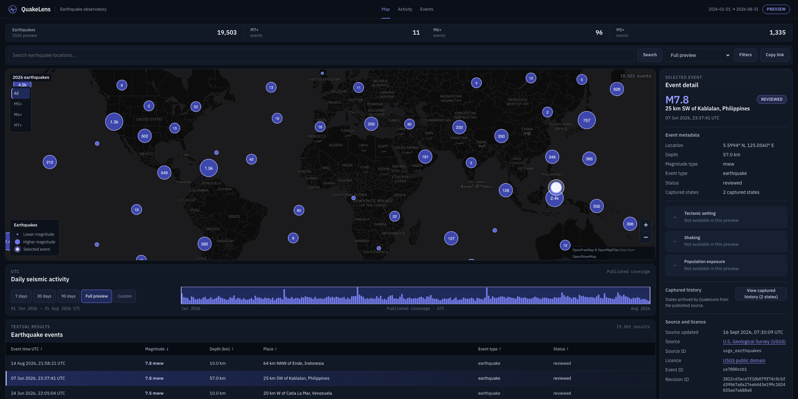
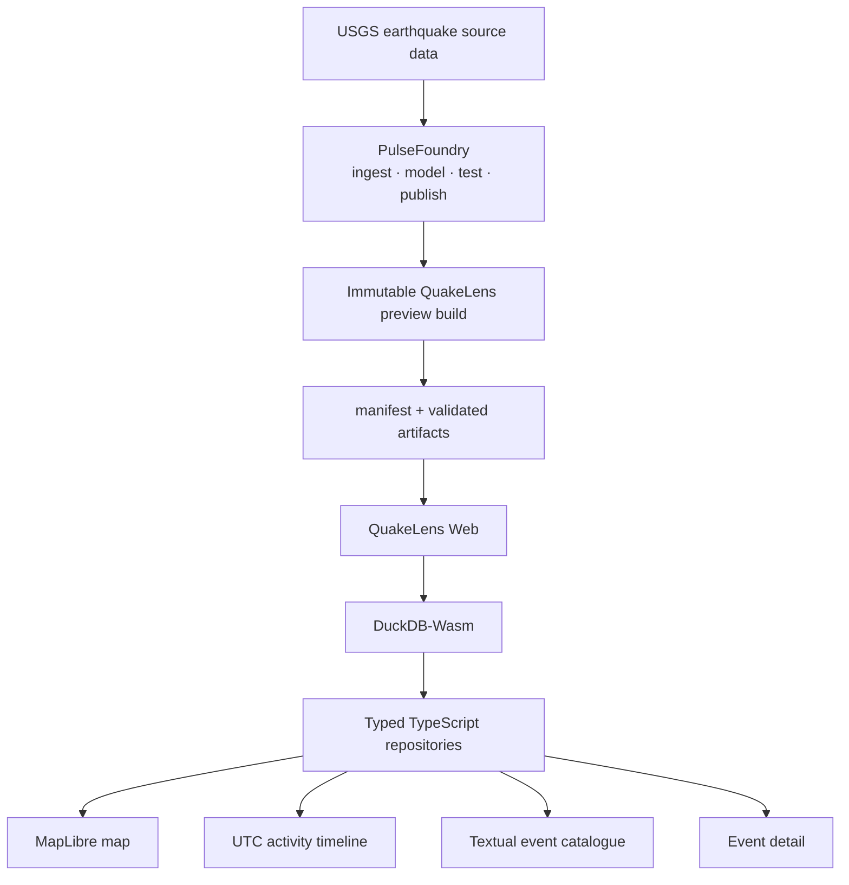

# QuakeLens

> **A map-first earthquake observatory for exploring global seismic activity, event history, and source-backed scientific context — directly in the browser.**

[**Open the live app →**](https://wato95.github.io/quakelens-web/) · [Architecture](#architecture) · [Run locally](#run-locally)



<p align="center">
  <strong>19,503 earthquake events · 2026 preview · static-first · no runtime application backend</strong>
</p>

QuakeLens turns a published earthquake catalogue into an interactive analytical product. The V1 experience combines a clustered global map, synchronized UTC activity timeline, searchable and sortable event catalogue, and detailed event inspection in one shared browser state.

The application is deliberately **static-first**: immutable analytical artifacts are published ahead of time, loaded through a manifest, and queried locally with DuckDB-Wasm. The browser does not need a runtime API or database to deliver the core experience.

---

## Explore earthquakes, not just dots on a map

QuakeLens is designed around a single connected exploration workflow:

- **Browse the global catalogue** on a MapLibre map with magnitude-aware markers and clustering.
- **Move through time** with 7-day, 30-day, 90-day, full-preview, and custom UTC windows.
- **Search and filter** earthquake locations with magnitude and depth controls plus M5+, M6+, and M7+ map presets.
- **Inspect individual events** from either the map or textual catalogue without losing the current analytical context.
- **Compare activity through time** using the published daily seismic-activity timeline.
- **Share an exact view** because time range, filters, selected event, sorting, and pagination are encoded into the URL.

### V1 at a glance

| | |
|---|---:|
| Published earthquake events | **19,503** |
| Preview period | **2026** |
| Map | **MapLibre GL JS** |
| Browser analytics | **DuckDB-Wasm** |
| Published analytical format | **Parquet** |
| Runtime application backend | **None required** |
| Primary earthquake source | **U.S. Geological Survey (USGS)** |
| Textual results page size | **24 events** |

---

## Product walkthrough

### One selection, shared everywhere

Selecting an earthquake updates the map, textual results, and detail surface together. The selected event remains independently visible while the surrounding catalogue reclusters.

### Time is a first-class filter

The daily activity timeline and catalogue use one shared UTC window. Presets, direct date selection, and custom ranges all query the same event repository, so the map and textual catalogue stay synchronized.

---

## Why this repository is technically interesting

QuakeLens is intentionally more than a map frontend.

### Static analytical application

The core analytical path runs entirely in the browser:

- an immutable preview release is selected from PulseFoundry output;
- a manifest declares the published artifacts;
- artifact byte counts and SHA-256 hashes are validated during synchronization;
- Parquet data is queried through DuckDB-Wasm;
- React components consume typed repository methods rather than embedding SQL or storage-layout knowledge.

This keeps the UI independent of Parquet layout, Arrow details, SQL, and local filesystem paths.

### One state model across the product

The toolbar, map, timeline, event table, and event-detail surface all consume the same application state. URL state can restore:

`event`, `range`, `from`, `to`, `minMag`, `maxMag`, `minDepth`, `maxDepth`, `type`, `status`, `review`, `q`, `sort`, `dir`, and `page`.

Invalid query-string values are normalized to safe defaults and published manifest coverage rather than being trusted as deployment configuration.

### Deterministic data boundary

Normal tests use a small committed PF1-208 contract fixture. They do not require PulseFoundry or a live USGS service, while explicit smoke tests can exercise the real published preview.

### Product semantics before visual decoration

QuakeLens keeps scientific availability explicit. V1 exposes tectonic setting, shaking, and population exposure as unavailable when those products are not part of the published preview rather than fabricating substitute values.

---

## Architecture



### Browser data flow

```text
manifest
   ↓
validated immutable artifacts
   ↓
DuckDB-Wasm
   ↓
typed repository layer
   ↓
shared application state
   ├── map
   ├── activity timeline
   ├── filters + search
   ├── textual results
   └── selected-event detail
```

The map and textual catalogue query the same event summaries. Daily activity is loaded as its own published artifact rather than being silently recomputed from whichever filtered events happen to be in memory.

---

## Scientific boundaries

QuakeLens is an **earthquake exploration product**, not a damage-assessment or emergency-response model.

V1 deliberately does not turn incomplete scientific context into implied certainty:

- **Tectonic setting** — not available in the current preview.
- **Shaking** — not available in the current preview.
- **Population exposure** — not available in the current preview.
- Census population context, where present behind the data boundary, is not aggregated or presented as official population exposure.

These states are visible product semantics, not missing UI polish.

---

## Run locally

### Requirements

- Node.js 22.12 or newer
- npm 10 or newer
- a neighbouring PulseFoundry checkout containing a published QuakeLens preview

### Start the application

```bash
npm install
npm run data:sync -- ../pulse-foundry
npm run dev
```

Vite prints the local URL when the development server starts.

`data:sync` locates `published/quakelens-preview` beneath the supplied PulseFoundry checkout, selects the valid immutable build with the latest manifest `generated_at`, validates its four artifacts, copies them into the gitignored local preview directory, and writes the browser configuration to `.env.local`.

<details>
<summary><strong>Pin a specific immutable preview build</strong></summary>

```bash
npm run data:sync -- ../pulse-foundry --build 20260921T204938Z-a14edef9b000
```

The V1 release described by this repository is pinned to:

```text
20260921T204938Z-a14edef9b000
```

</details>

<details>
<summary><strong>Use a different MapLibre-compatible basemap</strong></summary>

The application defaults to the attribution-bearing OpenFreeMap dark style.

```bash
VITE_QUAKELENS_MAP_STYLE_URL=https://example.org/styles/quakelens-dark/style.json
```

The selected style must be compatible with MapLibre and include the required source/data attribution.

</details>

---

## Quality gates

The repository treats the published data boundary and browser behaviour as testable engineering contracts.

```bash
npm run lint
npm run format:check
npm run typecheck
npm run test
npm run test:data-sync
npm run test:release
npm run build
```

Install Playwright Chromium once and run the desktop/mobile smoke suite:

```bash
npx playwright install chromium
npm run test:e2e
```

### Test the pinned production build

```bash
npm run release:build -- \
  ../pulse-foundry \
  --build 20260921T204938Z-a14edef9b000 \
  --base /quakelens-web/

npm run test:e2e:release
```

### Opt-in smoke test against the real preview

```bash
QLW_REAL_PREVIEW_SMOKE=1 npm run test:e2e -- \
  tests/repository-real-preview.spec.ts --project=desktop-chromium
```

The real-catalogue map smoke test verifies that all **19,503** preview events reach the clustered MapLibre source:

```bash
QLW_REAL_PREVIEW_SMOKE=1 npm run test:e2e -- \
  tests/map-real-preview.spec.ts --project=desktop-chromium
```

---

## Release and deployment

QuakeLens V1 is designed to be deployed as a static GitHub Pages application.

- **Live app:** [REPLACE_WITH_LIVE_APP_URL](https://wato95.github.io/quakelens-web/)
- **V1 preview notes:** [`docs/v1-preview.md`](docs/v1-preview.md)
- **Deployment process:** [`docs/deployment.md`](docs/deployment.md)

Generated preview data remains outside the source branch. The deployment consumes an explicitly selected immutable publication rather than silently bundling whichever local data happens to be present.

---

## Data source and attribution

Earthquake data in the V1 preview is sourced from the **U.S. Geological Survey (USGS)** and retains source identifiers and source metadata in the product.

- **Earthquake source:** [USGS — REPLACE_WITH_EXACT_SOURCE_LINK](https://earthquake.usgs.gov/data/comcat/)

Credit: U.S. Geological Survey for the ComCat earthquake data.

The basemap uses an attribution-bearing OpenFreeMap style by default. Map attribution remains visible in the application.

---

## Relationship to PulseFoundry

QuakeLens is the browser-facing product. **PulseFoundry** owns the upstream analytical data-product workflow.

```text
public source data
      ↓
  PulseFoundry
      ↓
immutable, tested analytical publication
      ↓
   QuakeLens
```

That separation is intentional:

**PulseFoundry** demonstrates data acquisition, transformation, validation, contracts, and reproducible publication.

**QuakeLens** demonstrates how a polished analytical application can consume those products without requiring a runtime data platform.

---

## V1 scope

The current release focuses on the map-first earthquake browsing experience:

- global clustered earthquake map;
- magnitude-aware event markers;
- shared event selection;
- daily seismic activity timeline;
- preset and custom UTC ranges;
- location-text search;
- magnitude and depth filters;
- M5+, M6+, and M7+ quick filters;
- sortable textual event catalogue;
- 24-event pagination;
- deep-linkable browser state;
- event metadata and captured-state history;
- polished desktop-first analytical interface;
- explicit scientific availability states;
- static GitHub Pages release path.

See [`docs/v1-preview.md`](docs/v1-preview.md) for the pinned release scope and limitations.

---

## Repository design notes

Application components consume semantic CSS tokens from `src/styles/`.

The reserved `src/styles/scientific/mmi.css` file is intentionally not imported in V1: MMI colours are scientific encodings rather than general application colours and should only appear when the corresponding shaking product is genuinely available.

Filter and sort SQL remains inside the typed event repository. Query-string parsing and serialization are kept separate from the configured manifest URL, and browser back/forward navigation restores the same shared state used by the toolbar, map, timeline, results table, and event detail.

---

## Licence

QuakeLens source code is available under the
[MIT License](LICENSE).

Earthquake data, map data, basemap styles, and third-party software retain
their respective licences and attribution requirements. See
[Third-party notices and attribution](THIRD_PARTY_NOTICES.md) for details.
